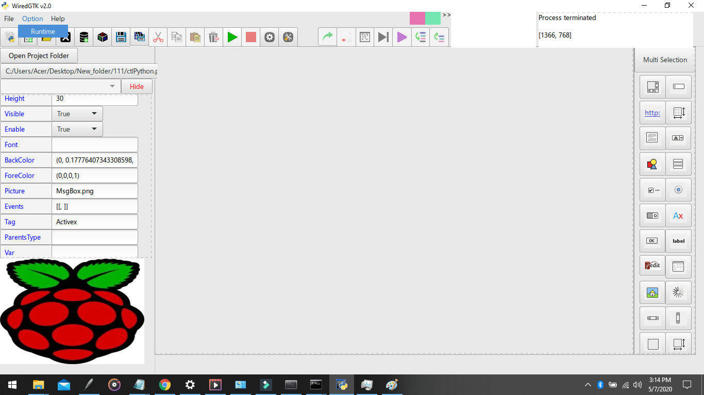

# Wired-GTK Windows7/10
Download http://wirethemall.com/WiredGTK2.1Windows.zip
Follow Instructions in the readmelink.txt 

You may now use Wired GTK for python, it uses default python3.4 

Wired GTK 2.1 Screenshot may 2020

----------------------------------------------------------------------------------------------------------

if you want to use Python3.7 With Tensorflow and PyGobject within WiredGKT follow the instruction below.

Download and install miniconda

from start menu run Anaconda Prompt(miniconda3)

#####################################################################################

this environment will be use for training tensorflow dataset(Super Easy TensorflowTraining GUI)

>conda create --name tensorflow1_15 tensorflow==1.15

>conda activate tensorflow1_15 

>pip install pandas

>pip install pillow

download models.zip from https://drive.google.com/file/d/1KDd1Xz-JTf_25AkPKDZE15YxlWTpS_Jx/view?usp=sharing 
1.create c:\tensorflow folder and extract it there(models folder)

make sure we are still in tensorflow1_15 virtual environment otherwise issue conda activate tensorflow1_15 

>cd c:\tensorflow\models\research

>protoc object_detection/protos/*.proto --python_out=.

>python setup.py build

>python setup.py install

>conda deactivate tensorflow1_15 

#####################################################################################

this environment will be use by WiredGTK runtime for TensorflowTrainingApp or any Tensorflow GUI related project.

>conda create --name wgtk tensorflow==2.0

>conda activate wgtk 

>conda install -c conda-forge gtk3

>conda install -c conda-forge pygobject

>conda install pillow

>conda install -c conda-forge mysqlclient

>conda install -c conda-forge opencv

>pip install pandas

>pip install requests

>pip install pyserial

>pip install imutils

>cd c:\tensorflow\models\research

>protoc object_detection/protos/*.proto --python_out=.

>python setup.py build

>python setup.py install

missing icons in PyGObject?

Download icon folder above extract it to c:\C:\Users\Acer\miniconda3\envs\wgtk\Library\share (Acer is your computer home)

#####################################################################################

RUN WiredGTK.bat

under Option-Runtime select python.exe in C:\Users\Acer\miniconda3\envs\wgtk	(Acer is your computer home)

/*Super Easy TensorflowTrainingApp GUI will be uploaded(SSD,Faster RCNN supported, either local training or Google Colab)*/ 

